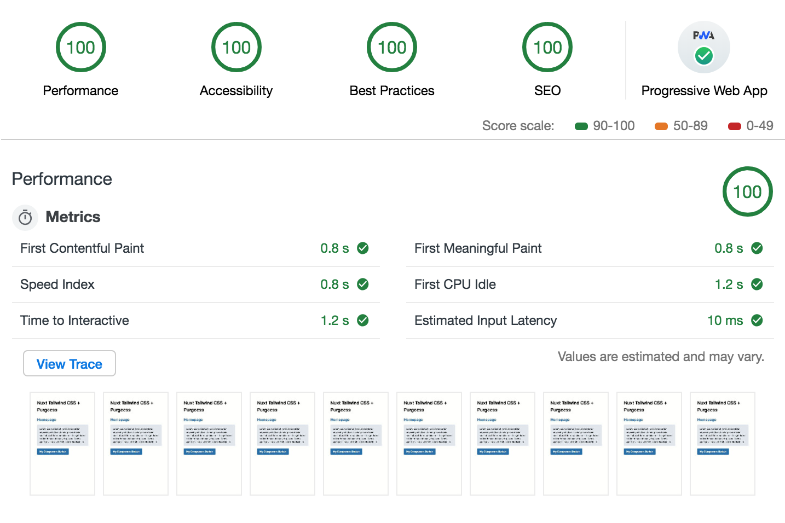

# nuxt-tailwind-purgecss

> A Nuxt.js example with Tailwind CSS v1.0 and Purgecss

## [LIVE DEMO](https://nuxt-tailwind-purgecss.netlify.com)

## Table of contents

- [Installation](#installation)
- [Usage](#usage)
  - [Dev](#run-the-app-locally)
  - [Build](#build-the-app)
- [Performance](#performance)
- [Credits](#credits)
  - [Authors](#authors)
  - [Software](#software)

## Installation

```bash
# Clone the repository
git clone https://github.com/stursby/nuxt-tailwind-purgecss.git

# Go into the repository
cd nuxt-tailwind-purgecss

# Install dependencies
yarn
# or npm install
```

## Usage

### Run the app locally

```bash
yarn dev
# or npm run dev
```

Now you should see the project at [http://localhost:3000](http://localhost:3000)

### Build the app

```bash
yarn build
# or npm run build
```

This will output the production files to the `/dist` folder. Note that I’m opting to use `nuxt generate` under the hood which renders the page(s) fully static. You can read more about the different Nuxt build options [here](https://nuxtjs.org/guide/commands/).

## Performance

Currently, this simple demo app scores very well in Chrome’s Lighthouse Audit. If you notices any performance issues, plese let me know, or submit a PR!



## Credits

### Authors

This project was created by:

- [Charlie Hield](https://github.com/stursby)

### Software

This project is build using the following software & plugins:

- [Vue](https://vuejs.org/)
- [Nuxt.js](https://nuxtjs.org/)
- [Tailwind CSS](http://showdownjs.github.io/showdown/)
- [Purgecss](https://github.com/FullHuman/purgecss)
- [nuxt-purgecss](https://github.com/Developmint/nuxt-purgecss)
- [@nuxt/pwa](https://pwa.nuxtjs.org/)
- [Netlify](https://www.netlify.com/)
